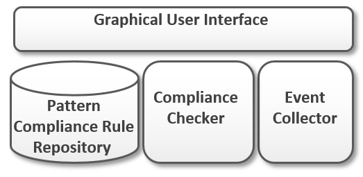

# ADDCompliance

This repo contains the prototype for monitoring behavioral compliance of pattern-based architectural design decisions during runtime.

## Overview

### Monitoring Framework (Pattern Compliance Monitor)
The Monitoring Framework is based on Spring Framework and the Esper complex event processing runtime. 
An overview of the main components is shown below: 

A repository was implemented that stores *Pattern Compliance Rules* each consisting of a pattern name and a set of EPL statements describing the order of events indicating a violation of the behavior described by the pattern.
The stored EPl statements serve as configuration for the *Compliance Checker* which is based on the Esper CEP engine.
The collection of application events was implemented based on the RabbitMQ message broker.
Applications can connect to broker and publish messages on a queue.
The *Event Collector* consumes the messages and adds them to the event stream observed by the *Compliance Checker*.
Detected violations are displayed in the monitoring dashboard implemented within the *Graphical User Interface*.

For the test setup we created *Pattern Compliance Rules* for the three patterns **Static Workload**, **Watchdog**, and **Circuit Breaker**.

### Example Application (Motivating Scenario)

In order to simulate a running application emmiting a stream of events, we implemented an exemplary microservice application and packaged each application component as a docker container image.
For each container image, we added a script that periodically sends messages containing information about the hosting environment to the running RabbitMQ instance.
In addition we implemented a simple proxy that is deployed alongside the application, so that communication between application components always goes through the proxy.
The proxy intercepts each HTTP request sent by an application component and emits a message containing the id of the sender and the status code of the request to indicate if the request failed or succeeded.

## Getting Started

### Run via Docker Swarm
The fastest way to get the monitoring framework and the motivating-scenario up and running is via the docker compose file located in the root folder. Just execute: 

`docker stack deploy -c docker-compose.yaml motivation-scenario`

The ports are mapped as follows:

- monitoring framework: localhost:8080
- rabbitMq: localhost:  localhost:9090 (user: guest, pw: guest)
- inventory-service:    localhost:5000
- shipping-service:     localhost:8088

Scaling an service in the swarm

`docker service scale SERVICE_NAME=INSTANCE_Count`

For example scaling the inventory service

`docker service scale motivation-scenario_inventory-service=INSTANCE_Count`

## Walkthrough

### Watchdog
Test the watchdog pattern by starting with **3** instances of **inventory-service** and decreasing the number of instances to **2** for at least the time that is defined by the *timeThreshold*:

1. Start instances of the defined *scalingGroup*:
   
    `docker service scale motivation-scenario_inventory-service=3`

2. Start the monitor

3. Scale the group down to **2** instances:

    `docker service scale motivation-scenario_inventory-service=2`

4. The watchdog pattern instance will be displayed as **violated** since the number of instances in the corresponding *scalingGroup* have not reached **3** again in the defined *timeThreshold*.

### Circuit Breaker
Test the Circuit Breaker pattern by executing the following steps:

1. Make sure that at least one instance of scaling group **inventory-service** is running:

     `docker service scale motivation-scenario_inventory-service=1`

2. Start the monitor with the pattern instance of Circuit Breaker that has a *timeoutDuration* of around 10 seconds (10000ms).

3. Scale down the **shipping-service** scaling group to 0:

    `docker service scale motivation-scenario_shipping-service=0`

4. Navigate to the location of **inventory-service** (currently localhost:5000) which will open its user interface. In this UI, one can send requests to **shipping-service**.

5. Quickly send more requests to **shipping-service** than the defined *failureThreshold* has been set by clicking the button.

6. The Circuit Breaker pattern instance will be displayed as **violated** since there is no instance of **shipping-service** and thus the executed requests have failed within the *timeoutDuration*.

